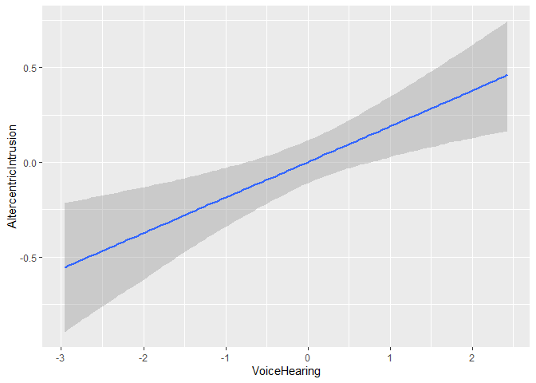

Assignment 3 - Exploring causal inference issues
------------------------------------------------

In this assignment we explore some issues related to multiple
regressions (regressions with more than one predictor), and inferred
(causal) relations between variables. N.B. the data is simulated (to
make sure I know the actual mechanism generating it), but it’s based on
a real study. So bear with a longish introduction to get into the
details of what we are doing and why it is important.

### Altercentric intrusion in schizophrenia

People with schizophrenia often report altered control and distinction
of self-other representations: intrusive thoughts, hearing of voices,
delusions of mind reading, paranoia, etc (a substantial portion of the
psychotic symptoms experienced in schizophrenia). These have been
variously attributed to hypermentalizing (over attribution of mental
states to others), social impairment (over preoccupation with own
thought processes), hyper socialization (inability to inhibit
information from others), etc.

The current study investigates 1) whether schizophrenia is indeed
related to altered control and distinction of self-other
representations, in particular altercentric intrusions (inability to
inhibit social information), and 2) whether these are related to the
relevant psychotic symptoms. N.B. the actual study also investigates
egocentric intrusion, do check the papers below if interested.

The task is a slightly modified version of this:
<a href="https://www.ncbi.nlm.nih.gov/pubmed/20731512" class="uri">https://www.ncbi.nlm.nih.gov/pubmed/20731512</a>
- Some dots visible to you - Different person with a different set of
dots visible to them. - Can be(congruent condition) or not (incongruent
condition). - You are tasked to indicate whether a given number (e.g. 3)
matches the number of dots you see (and the dots visible to the other
person are irrelevant to the task).

The tasks investigates altercentric intrusion –&gt; Will your RT change
according to whether the other person is seeing the same amount of dots
as you, or not?

So RT in relation to congruent vs. incongruent trials. So for longer RT
in incongruent trials –&gt; the bigger the altercentric intrusion effect

The idea is that if you correctly inhibit social information, your
reaction time should not change, as the information about the other
person is not relevant. On the contrary, if you nevertheless use task
irrelevant social information, you’ll be slower at indicating whether 3
is the right number of dots when the other person sees a different
amount of dots than you (conflicting information). The bigger the
difference between RTs in the congruent and incongruent condition the
bigger the altercentric intrusion effect.

For each participant you have 6 variables: 1) ID, 2)
AltercentricIntrusion (continuous score), 3) Diagnosis (schizophrenia
vs. control), 4) VoiceHearing (severity of voice hearing symptoms,
continuous score of the severity of the symptom as measured by a
clinician), 5) MindReading (severity of delusions of mind reading,
continuous score of the severity of the symptom as measured by a
clinician); 6) Apathy (severity of lack of motivation in taking care of
oneself, from washing to showing up at work, continuous score of the
severity of the symptom as measured by a clinician).

The research questions you have to answer are the following:

First part
----------

Q1.1) Does schizophrenia involve altercentric intrusion? Define model
and priors. Test the implications of your priors (prior predictive
checks) and if needed adjust them. Run the model. Test the quality of
the fitted model (posterior predictive checks). Assess the evidence in
favor of an increased altercentric intrusion in schizophrenia. Report
the model and the results, including plots.

``` r
pacman::p_load(tidyverse, brms)

# Prepare the data
setwd("~/Cognitive Science/4th semester/Computational modeling/R code/4sem_ass3")
d <- read_csv("Ass3.csv")
```

    ## Parsed with column specification:
    ## cols(
    ##   VoiceHearing = col_double(),
    ##   MindReading = col_double(),
    ##   Apathy = col_double(),
    ##   AltercentricIntrusion = col_double(),
    ##   ID = col_double(),
    ##   Diagnosis = col_double()
    ## )

``` r
#summary(d)

# We rename diagnosis varable
d$Diagnosis <- plyr::revalue(as.character(d$Diagnosis), 
                             c("0"="Controls", "1"="Schizophrenia")) 
# We make into factors
d <- d %>%
  mutate(
    ID = as.factor(ID),
    Diagnosis = as.factor(Diagnosis)
  )

# Define the formula with bf

# With an intercept
AltercentricDiagnosis_f0 <- bf(
  AltercentricIntrusion ~ 1 + Diagnosis
)

# We look at the preditors different from 0 so no intercept
AltercentricDiagnosis_f <- bf(
  AltercentricIntrusion ~ 0 + Diagnosis
)

# Design the priors

# We look at the default priors
get_prior(AltercentricDiagnosis_f0, family = gaussian, d)
```

    ##                 prior     class                   coef group resp dpar nlpar
    ## 1                             b                                             
    ## 2                             b DiagnosisSchizophrenia                      
    ## 3 student_t(3, 4, 10) Intercept                                             
    ## 4 student_t(3, 0, 10)     sigma                                             
    ##   bound
    ## 1      
    ## 2      
    ## 3      
    ## 4

``` r
get_prior(AltercentricDiagnosis_f, family = gaussian, d)
```

    ##                 prior class                   coef group resp dpar nlpar bound
    ## 1                         b                                                   
    ## 2                         b      DiagnosisControls                            
    ## 3                         b DiagnosisSchizophrenia                            
    ## 4 student_t(3, 0, 10) sigma

``` r
# We make our own priors
priorDiagnosis <- c(
  prior(normal(4, 1), class = b),
  prior(normal(1, 2), class = sigma) # 2 then makes it possible to error up to 5
) 

# Test the priors

AltercentricDiagnosis_PriorCheck_m <- brm(
  formula = AltercentricDiagnosis_f,
  data = d,
  family = gaussian,
  prior = priorDiagnosis,
  sample_prior = "only", #Only looks at priors
  file = "AltercentricDiagnosis_PC"
)

#Prior predictive check
pp_check(AltercentricDiagnosis_PriorCheck_m, nsamples = 100) # Are the generated values in the right magnitude?
```


``` r
# It looks fine

## Fitting the model
AltercentricDiagnosis_m <- brm(
  formula = AltercentricDiagnosis_f,
  data = d,
  family = gaussian,
  prior = priorDiagnosis,
  sample_prior = T,
  file = "AltercentricDiagnosis"
)
AltercentricDiagnosis_m 
```

    ##  Family: gaussian 
    ##   Links: mu = identity; sigma = identity 
    ## Formula: AltercentricIntrusion ~ 0 + Diagnosis 
    ##    Data: d (Number of observations: 300) 
    ## Samples: 4 chains, each with iter = 2000; warmup = 1000; thin = 1;
    ##          total post-warmup samples = 4000
    ## 
    ## Population-Level Effects: 
    ##                        Estimate Est.Error l-95% CI u-95% CI Rhat Bulk_ESS
    ## DiagnosisControls          3.86      0.06     3.74     3.98 1.00     3671
    ## DiagnosisSchizophrenia     4.22      0.11     4.01     4.44 1.00     3971
    ##                        Tail_ESS
    ## DiagnosisControls          2644
    ## DiagnosisSchizophrenia     2563
    ## 
    ## Family Specific Parameters: 
    ##       Estimate Est.Error l-95% CI u-95% CI Rhat Bulk_ESS Tail_ESS
    ## sigma     0.91      0.04     0.84     1.00 1.00     4186     2972
    ## 
    ## Samples were drawn using sampling(NUTS). For each parameter, Bulk_ESS
    ## and Tail_ESS are effective sample size measures, and Rhat is the potential
    ## scale reduction factor on split chains (at convergence, Rhat = 1).

``` r
# Posterior predictive check
pp_check(AltercentricDiagnosis_m, nsamples = 100)
```


``` r
# "the data looks fantastic" - Riccardo Fusaroli

## Check the model for warnings
AltercentricDiagnosis_m
```

    ##  Family: gaussian 
    ##   Links: mu = identity; sigma = identity 
    ## Formula: AltercentricIntrusion ~ 0 + Diagnosis 
    ##    Data: d (Number of observations: 300) 
    ## Samples: 4 chains, each with iter = 2000; warmup = 1000; thin = 1;
    ##          total post-warmup samples = 4000
    ## 
    ## Population-Level Effects: 
    ##                        Estimate Est.Error l-95% CI u-95% CI Rhat Bulk_ESS
    ## DiagnosisControls          3.86      0.06     3.74     3.98 1.00     3671
    ## DiagnosisSchizophrenia     4.22      0.11     4.01     4.44 1.00     3971
    ##                        Tail_ESS
    ## DiagnosisControls          2644
    ## DiagnosisSchizophrenia     2563
    ## 
    ## Family Specific Parameters: 
    ##       Estimate Est.Error l-95% CI u-95% CI Rhat Bulk_ESS Tail_ESS
    ## sigma     0.91      0.04     0.84     1.00 1.00     4186     2972
    ## 
    ## Samples were drawn using sampling(NUTS). For each parameter, Bulk_ESS
    ## and Tail_ESS are effective sample size measures, and Rhat is the potential
    ## scale reduction factor on split chains (at convergence, Rhat = 1).

``` r
#Has the posterior learned from the data? Less uncertain than prior predictive check
# Hypothesis testing + updating check
plot(hypothesis(AltercentricDiagnosis_m,
           "DiagnosisSchizophrenia > DiagnosisControls"))
```


``` r
hypothesis(AltercentricDiagnosis_m,
           "DiagnosisSchizophrenia > DiagnosisControls")
```

    ## Hypothesis Tests for class b:
    ##                 Hypothesis Estimate Est.Error CI.Lower CI.Upper Evid.Ratio
    ## 1 (DiagnosisSchizop... > 0     0.36      0.12     0.16     0.56        499
    ##   Post.Prob Star
    ## 1         1    *
    ## ---
    ## 'CI': 90%-CI for one-sided and 95%-CI for two-sided hypotheses.
    ## '*': For one-sided hypotheses, the posterior probability exceeds 95%;
    ## for two-sided hypotheses, the value tested against lies outside the 95%-CI.
    ## Posterior probabilities of point hypotheses assume equal prior probabilities.

``` r
# the beta value indicates a difference, and by looking at the error and confidence intervals we see that it is likely that this difference is "true". 

conditional_effects(AltercentricDiagnosis_m)
```


``` r
# The participants level of altercentric intrusion vs. model's estimate.
plot(conditional_effects(AltercentricDiagnosis_m), points=T)
```


The model indicates a credible difference in altercentric intrusion in
the two groups supporting our hypothesis (b = 0.36, CIs = 0.16, 0.57, ER
= 1332).

Controls showed on average an altercentric intrusion effect of 3.86 (CIs
3.74, 3.98), and schizophrenia of 4.22 (CIs = 4.01, 4.43).

\[Add plot of the effects\]

SI
==

The model had no divergences, a Rhat of 1, and Effective Sample Sizes
above 2000 for both Bulk and Tail. \[Add prior and posterior checks
plots; add updating check plot\]

Q1.2) Is altercentric intrusion related to specific symptoms *in the
patients*? Identify which of the symptoms could be relevant. Should you
include more than one symptom? Build models, priors, predictive checks.
Assess the evidence and report models and results, including plots.
Discuss whether the results make sense.

We should subset the data to only contrain scitzophrenics because we
usually never get data for symptoms of controls

If we don’t scale there are pretty heavy correlations between intercept
and slope

``` r
# We scale the data
d <- d %>% 
  mutate(
  AltercentricIntrusion = scale(AltercentricIntrusion),
  VoiceHearing = scale(VoiceHearing),
  MindReading = scale(MindReading),
  Apathy = scale(Apathy)
)

# We subset the data
d <- d %>% subset(Diagnosis == "Schizophrenia")
```

For VoiceHearing

``` r
#Predict altercentric intrusion from the other symptoms. 

# Does VoiceHearing predict altercentric intrusion
# We make a model for each of the symptoms

# Define the formula with bf

# With a continous predictor we want an intercept in the model

# We look at the preditors different from 0 so no intercept
AltercentricVH<- bf(
  AltercentricIntrusion ~ 1 + VoiceHearing
)

# Design the priors

# We look at the default priors
get_prior(AltercentricVH, family = gaussian, d)
```

    ##                 prior     class         coef group resp dpar nlpar bound
    ## 1                             b                                         
    ## 2                             b VoiceHearing                            
    ## 3 student_t(3, 0, 10) Intercept                                         
    ## 4 student_t(3, 0, 10)     sigma

``` r
# We make our own priors
priorVH <- c(
  prior(normal(0, 1), class = Intercept),
  prior(normal(0, .3), class = b),
  prior(normal(1, 2), class = sigma) 
) 

# Test the priors

AltercentricVH_PriorCheck_m <- brm(
  formula = AltercentricVH,
  data = d,
  family = gaussian,
  prior = priorVH,
  sample_prior = "only", #Only looks at priors
  file = "AltercentricVoiceHearing_PC_1"
)

#Prior predictive check
pp_check(AltercentricVH_PriorCheck_m, nsamples = 100) # Are the generated values in the right magnitude?
```


``` r
# It looks fine


## Fitting the model
AltercentricVH_m <- brm(
  formula = AltercentricVH,
  data = d,
  family = gaussian,
  prior = priorVH,
  sample_prior = T,
  file = "AltercentricVoiceHearing"
)

pp_check(AltercentricVH_m, nsamples = 100)
```


``` r
# 

conditional_effects(AltercentricVH_m)
```


``` r
# The participants level of altercentric intrusion vs. model's estimate.
plot(conditional_effects(AltercentricVH_m), points=T)
```


``` r
# Hypothesis testing
hypothesis(AltercentricVH_m,
           "VoiceHearing > 0")
```

    ## Hypothesis Tests for class b:
    ##           Hypothesis Estimate Est.Error CI.Lower CI.Upper Evid.Ratio Post.Prob
    ## 1 (VoiceHearing) > 0     0.05      0.11    -0.12     0.23        2.3       0.7
    ##   Star
    ## 1     
    ## ---
    ## 'CI': 90%-CI for one-sided and 95%-CI for two-sided hypotheses.
    ## '*': For one-sided hypotheses, the posterior probability exceeds 95%;
    ## for two-sided hypotheses, the value tested against lies outside the 95%-CI.
    ## Posterior probabilities of point hypotheses assume equal prior probabilities.

``` r
# 0.05, evid ratio 2.3
```

For Mind-Reading

``` r
# We look at the preditors different from 0 so no intercept
AltercentricMR<- bf(
  AltercentricIntrusion ~ 1 + MindReading
)

# Design the priors

# We look at the default priors
get_prior(AltercentricMR, family = gaussian, d)
```

    ##                 prior     class        coef group resp dpar nlpar bound
    ## 1                             b                                        
    ## 2                             b MindReading                            
    ## 3 student_t(3, 0, 10) Intercept                                        
    ## 4 student_t(3, 0, 10)     sigma

``` r
# We make our own priors
priorMR <- c(
  prior(normal(0, 1), class = Intercept),
  prior(normal(0, 0.3), class = b),
  prior(normal(1, 2), class = sigma) # 2 then makes it possible to error up to 5
) 

# Test the priors

AltercentricMR_PriorCheck_m <- brm(
  formula = AltercentricMR,
  data = d,
  family = gaussian,
  prior = priorMR,
  sample_prior = "only", #Only looks at priors
  file = "AltercentricMR_PC"
)

#Prior predictive check
pp_check(AltercentricMR_PriorCheck_m, nsamples = 100) # Are the generated values in the right magnitude?
```


``` r
# It looks fine

## Fitting the model
AltercentricMR_m <- brm(
  formula = AltercentricMR,
  data = d,
  family = gaussian,
  prior = priorVH,
  sample_prior = T,
  file = "AltercentricMR"
)


pp_check(AltercentricMR_m, nsamples = 100)
```


``` r
conditional_effects(AltercentricMR_m)
```


``` r
# The participants level of altercentric intrusion vs. model's estimate.
plot(conditional_effects(AltercentricMR_m), points=T)
```


``` r
# Hypothesis testing
hypothesis(AltercentricMR_m,
           "MindReading > 0")
```

    ## Hypothesis Tests for class b:
    ##          Hypothesis Estimate Est.Error CI.Lower CI.Upper Evid.Ratio Post.Prob
    ## 1 (MindReading) > 0     0.08      0.11    -0.11     0.26        3.1      0.76
    ##   Star
    ## 1     
    ## ---
    ## 'CI': 90%-CI for one-sided and 95%-CI for two-sided hypotheses.
    ## '*': For one-sided hypotheses, the posterior probability exceeds 95%;
    ## for two-sided hypotheses, the value tested against lies outside the 95%-CI.
    ## Posterior probabilities of point hypotheses assume equal prior probabilities.

``` r
# Estimate 0.08, evid ratio 3.1
```

For Apathy

``` r
# We look at the preditors different from 0 so no intercept
AltercentricA<- bf(
  AltercentricIntrusion ~ 1 + Apathy
)

# Design the priors

# We look at the default priors
get_prior(AltercentricA, family = gaussian, d)
```

    ##                 prior     class   coef group resp dpar nlpar bound
    ## 1                             b                                   
    ## 2                             b Apathy                            
    ## 3 student_t(3, 0, 10) Intercept                                   
    ## 4 student_t(3, 0, 10)     sigma

``` r
# We make our own priors
priorA <- c(
  prior(normal(0, 1), class = Intercept),
  prior(normal(0, 0.3), class = b),
  prior(normal(1, 2), class = sigma) # 2 then makes it possible to error up to 5
) 

# Test the priors

AltercentricA_PriorCheck_m <- brm(
  formula = AltercentricA,
  data = d,
  family = gaussian,
  prior = priorA,
  sample_prior = "only", #Only looks at priors
  file = "AltercentricA_PC"
)

#Prior predictive check
pp_check(AltercentricA_PriorCheck_m, nsamples = 100) # Are the generated values in the right magnitude?
```


``` r
# It looks fine

## Fitting the model
AltercentricA_m <- brm(
  formula = AltercentricA,
  data = d,
  family = gaussian,
  prior = priorA,
  sample_prior = T,
  file = "AltercentricA"
)

AltercentricA_m
```

    ##  Family: gaussian 
    ##   Links: mu = identity; sigma = identity 
    ## Formula: AltercentricIntrusion ~ 1 + Apathy 
    ##    Data: d (Number of observations: 75) 
    ## Samples: 4 chains, each with iter = 2000; warmup = 1000; thin = 1;
    ##          total post-warmup samples = 4000
    ## 
    ## Population-Level Effects: 
    ##           Estimate Est.Error l-95% CI u-95% CI Rhat Bulk_ESS Tail_ESS
    ## Intercept    -0.00      0.11    -0.22     0.23 1.00     3561     2845
    ## Apathy       -0.17      0.11    -0.39     0.04 1.00     3910     2811
    ## 
    ## Family Specific Parameters: 
    ##       Estimate Est.Error l-95% CI u-95% CI Rhat Bulk_ESS Tail_ESS
    ## sigma     1.00      0.09     0.86     1.19 1.00     3498     2552
    ## 
    ## Samples were drawn using sampling(NUTS). For each parameter, Bulk_ESS
    ## and Tail_ESS are effective sample size measures, and Rhat is the potential
    ## scale reduction factor on split chains (at convergence, Rhat = 1).

``` r
pp_check(AltercentricA_m, nsamples = 100)
```


``` r
# 

conditional_effects(AltercentricA_m)
```


``` r
# The participants level of altercentric intrusion vs. model's estimate.
plot(conditional_effects(AltercentricA_m), points=T)
```


``` r
# Hypothesis testing
hypothesis(AltercentricA_m,
           "Apathy < 0")
```

    ## Hypothesis Tests for class b:
    ##     Hypothesis Estimate Est.Error CI.Lower CI.Upper Evid.Ratio Post.Prob Star
    ## 1 (Apathy) < 0    -0.17      0.11    -0.36     0.01      16.09      0.94     
    ## ---
    ## 'CI': 90%-CI for one-sided and 95%-CI for two-sided hypotheses.
    ## '*': For one-sided hypotheses, the posterior probability exceeds 95%;
    ## for two-sided hypotheses, the value tested against lies outside the 95%-CI.
    ## Posterior probabilities of point hypotheses assume equal prior probabilities.

``` r
# 
```

Together in a multilevel model

``` r
# We make the formula
AltercentricMRVH <- bf(
  AltercentricIntrusion ~ 1 + VoiceHearing + MindReading
)

# Design the priors

# We look at the default priors
get_prior(AltercentricMRVH, family = gaussian, d)
```

    ##                 prior     class         coef group resp dpar nlpar bound
    ## 1                             b                                         
    ## 2                             b  MindReading                            
    ## 3                             b VoiceHearing                            
    ## 4 student_t(3, 0, 10) Intercept                                         
    ## 5 student_t(3, 0, 10)     sigma

``` r
# We make our own priors
priorMRVH <- c(
  prior(normal(0, 1), class = Intercept),
  prior(normal(0, 0.3), class = b),
  prior(normal(1, 2), class = sigma) # 2 then makes it possible to error up to 5
) 

# Test the priors

AltercentricMRVH_PriorCheck_m <- brm(
  formula = AltercentricMRVH,
  data = d,
  family = gaussian,
  prior = priorMRVH,
  sample_prior = "only", #Only looks at priors
  file = "AltercentricMRVH_PC"
)

#Prior predictive check
pp_check(AltercentricMRVH_PriorCheck_m, nsamples = 100) # Are the generated values in the right magnitude?
```


``` r
# It looks fine

## Fitting the model
AltercentricMRVH_m <- brm(
  formula = AltercentricMRVH,
  data = d,
  family = gaussian,
  prior = priorMRVH,
  sample_prior = T, 
  file = "AltercentricMRVH"
)
AltercentricMRVH_m
```

    ##  Family: gaussian 
    ##   Links: mu = identity; sigma = identity 
    ## Formula: AltercentricIntrusion ~ 1 + VoiceHearing + MindReading 
    ##    Data: d (Number of observations: 75) 
    ## Samples: 4 chains, each with iter = 2000; warmup = 1000; thin = 1;
    ##          total post-warmup samples = 4000
    ## 
    ## Population-Level Effects: 
    ##              Estimate Est.Error l-95% CI u-95% CI Rhat Bulk_ESS Tail_ESS
    ## Intercept        0.12      0.20    -0.28     0.53 1.00     3590     2674
    ## VoiceHearing     0.10      0.14    -0.18     0.38 1.00     3874     3170
    ## MindReading      0.10      0.11    -0.13     0.33 1.00     3754     2951
    ## 
    ## Family Specific Parameters: 
    ##       Estimate Est.Error l-95% CI u-95% CI Rhat Bulk_ESS Tail_ESS
    ## sigma     0.90      0.08     0.77     1.06 1.00     3940     2971
    ## 
    ## Samples were drawn using sampling(NUTS). For each parameter, Bulk_ESS
    ## and Tail_ESS are effective sample size measures, and Rhat is the potential
    ## scale reduction factor on split chains (at convergence, Rhat = 1).

``` r
pp_check(AltercentricMRVH_m, nsamples = 100)
```


``` r
stanplot(AltercentricMRVH_m)
```

    ## Warning: Method 'stanplot' is deprecated. Please use 'mcmc_plot' instead.


``` r
# Hypothesis testing
hypothesis(AltercentricMRVH_m,
           "MindReading > 0")
```

    ## Hypothesis Tests for class b:
    ##          Hypothesis Estimate Est.Error CI.Lower CI.Upper Evid.Ratio Post.Prob
    ## 1 (MindReading) > 0      0.1      0.11    -0.09     0.29       4.22      0.81
    ##   Star
    ## 1     
    ## ---
    ## 'CI': 90%-CI for one-sided and 95%-CI for two-sided hypotheses.
    ## '*': For one-sided hypotheses, the posterior probability exceeds 95%;
    ## for two-sided hypotheses, the value tested against lies outside the 95%-CI.
    ## Posterior probabilities of point hypotheses assume equal prior probabilities.

``` r
hypothesis(AltercentricMRVH_m,
           "VoiceHearing > 0")
```

    ## Hypothesis Tests for class b:
    ##           Hypothesis Estimate Est.Error CI.Lower CI.Upper Evid.Ratio Post.Prob
    ## 1 (VoiceHearing) > 0      0.1      0.14    -0.14     0.33       3.48      0.78
    ##   Star
    ## 1     
    ## ---
    ## 'CI': 90%-CI for one-sided and 95%-CI for two-sided hypotheses.
    ## '*': For one-sided hypotheses, the posterior probability exceeds 95%;
    ## for two-sided hypotheses, the value tested against lies outside the 95%-CI.
    ## Posterior probabilities of point hypotheses assume equal prior probabilities.

``` r
# Estimate 0.04, evid 1.85
```

Multilevel model with all predictors

``` r
# We make the formula
AltercentricMRVHA <- bf(
  AltercentricIntrusion ~ 1 + MindReading + VoiceHearing + Apathy
)

# Design the priors

# We look at the default priors
get_prior(AltercentricMRVHA, family = gaussian, d)
```

    ##                 prior     class         coef group resp dpar nlpar bound
    ## 1                             b                                         
    ## 2                             b       Apathy                            
    ## 3                             b  MindReading                            
    ## 4                             b VoiceHearing                            
    ## 5 student_t(3, 0, 10) Intercept                                         
    ## 6 student_t(3, 0, 10)     sigma

``` r
# We make our own priors
priorMRVHA <- c(
  prior(normal(0, 1), class = Intercept),
  prior(normal(0, 0.3), class = b),
  prior(normal(1, 2), class = sigma) # 2 then makes it possible to error up to 5
) 

# Test the priors

AltercentricMRVHA_PriorCheck <- brm(
  formula = AltercentricMRVHA,
  data = d,
  family = gaussian,
  prior = priorMRVHA,
  sample_prior = "only", #Only looks at priors
  file = "AltercentricMRVHA_PC"
)

#Prior predictive check
pp_check(AltercentricMRVHA_PriorCheck, nsamples = 100) # Are the generated values in the right magnitude?
```


``` r
# It looks fine

## Fitting the model
AltercentricMRVHA_m <- brm(
  formula = AltercentricMRVHA,
  data = d,
  family = gaussian,
  prior = priorMRVHA,
  sample_prior = T, 
  file = "AltercentricMRVHA"
)

pp_check(AltercentricMRVHA_m, nsamples = 100)
```


``` r
# Hypothesis testing
hypothesis(AltercentricMRVHA_m,
           "Apathy > 0")
```

    ## Hypothesis Tests for class b:
    ##     Hypothesis Estimate Est.Error CI.Lower CI.Upper Evid.Ratio Post.Prob Star
    ## 1 (Apathy) > 0    -0.15      0.12    -0.36     0.06       0.13      0.12     
    ## ---
    ## 'CI': 90%-CI for one-sided and 95%-CI for two-sided hypotheses.
    ## '*': For one-sided hypotheses, the posterior probability exceeds 95%;
    ## for two-sided hypotheses, the value tested against lies outside the 95%-CI.
    ## Posterior probabilities of point hypotheses assume equal prior probabilities.

``` r
# Estimate 
```

We can do model comparison

``` r
AltercentricVH_c <- add_criterion(AltercentricVH_m, criterion = "loo")
```

    ## Automatically saving the model object in 'AltercentricVoiceHearing.rds'

``` r
AltercentricMR_c <- add_criterion(AltercentricMR_m, criterion = "loo")
```

    ## Automatically saving the model object in 'AltercentricMR.rds'

``` r
AltercentricA_c <- add_criterion(AltercentricA_m, criterion = "loo")
```

    ## Automatically saving the model object in 'AltercentricA.rds'

``` r
AltercentricMRVH_c <- add_criterion(AltercentricMRVH_m, criterion = "loo")
```

    ## Automatically saving the model object in 'AltercentricMRVH.rds'

``` r
AltercentricMRVHA_c <- add_criterion(AltercentricMRVHA_m, criterion = "loo")
```

    ## Automatically saving the model object in 'AltercentricMRVHA.rds'

``` r
loo_compare(AltercentricVH_c, 
               AltercentricMR_c, 
               AltercentricA_c, 
               AltercentricMRVH_c, 
               AltercentricMRVHA_c)
```

    ## Warning: Not all models have the same y variable. ('yhash' attributes do not
    ## match)

    ##                     elpd_diff se_diff
    ## AltercentricMRVH_c   0.0       0.0   
    ## AltercentricA_c     -7.6       1.3   
    ## AltercentricMR_c    -8.7       0.7   
    ## AltercentricVH_c    -8.9       0.7   
    ## AltercentricMRVHA_c -9.2       1.1

``` r
loo_model_weights(AltercentricVH_c, 
               AltercentricMR_c, 
               AltercentricA_c, 
               AltercentricMRVH_c, 
               AltercentricMRVHA_c)
```

    ## Method: stacking
    ## ------
    ##                     weight
    ## AltercentricVH_c    0.000 
    ## AltercentricMR_c    0.000 
    ## AltercentricA_c     0.000 
    ## AltercentricMRVH_c  1.000 
    ## AltercentricMRVHA_c 0.000

We expect VH and MR to be related to AI but not Apathy A model
comparison approach predicting AI from apathy is the best model
minimizing estimated out of sample error stacking weight of 1. Adding
other symptoms does not improve generalizability of the model.

Second part
-----------

Q2.1) However, we know that the diagnosis is based on symptom
assessment: if the overall sum of symptoms is severe enough, the
participant gets a diagnosis. In other words, by selecting the patients,
and including the symptoms in the model we might have inadvertently
introduced an issue in our inference. Do try to draw a causal graph
(Directed Acyclical Graph) of the variables and compare it with the
types of causal graphs presented in the slides. Discuss which biases you
might have introduced.

Q2.2.) Redesign your analysis following the graph and report how the
results change

``` r
# Prepare the data
d <- read_csv("Ass3.csv")
```

    ## Parsed with column specification:
    ## cols(
    ##   VoiceHearing = col_double(),
    ##   MindReading = col_double(),
    ##   Apathy = col_double(),
    ##   AltercentricIntrusion = col_double(),
    ##   ID = col_double(),
    ##   Diagnosis = col_double()
    ## )

``` r
#summary(d)

# We scale the data
d <- d %>% 
  mutate(
  AltercentricIntrusion = scale(AltercentricIntrusion),
  VoiceHearing = scale(VoiceHearing),
  MindReading = scale(MindReading),
  Apathy = scale(Apathy)
)
```

For VoiceHearing

``` r
#Predict altercentric intrusion from the other symptoms. 

# Does VoiceHearing predict altercentric intrusion
# We make a model for each of the symptoms

# Define the formula with bf

# With a continous predictor we want an intercept in the model

# We look at the preditors different from 0 so no intercept
AltercentricVH<- bf(
  AltercentricIntrusion ~ 1 + VoiceHearing
)

# Design the priors

# We look at the default priors
get_prior(AltercentricVH, family = gaussian, d)
```

    ##                 prior     class         coef group resp dpar nlpar bound
    ## 1                             b                                         
    ## 2                             b VoiceHearing                            
    ## 3 student_t(3, 0, 10) Intercept                                         
    ## 4 student_t(3, 0, 10)     sigma

``` r
# We make our own priors
priorVH <- c(
  prior(normal(0, 1), class = Intercept),
  prior(normal(0, .3), class = b),
  prior(normal(1, 2), class = sigma) 
) 

# Test the priors

AltercentricVH_PriorCheck_m <- brm(
  formula = AltercentricVH,
  data = d,
  family = gaussian,
  prior = priorVH,
  sample_prior = "only", #Only looks at priors
  file = "All_AltercentricVoiceHearing_PC_1"
)

#Prior predictive check
pp_check(AltercentricVH_PriorCheck_m, nsamples = 100) # Are the generated values in the right magnitude?
```


``` r
# It looks fine


## Fitting the model
AltercentricVH_m <- brm(
  formula = AltercentricVH,
  data = d,
  family = gaussian,
  prior = priorVH,
  sample_prior = T,
  file = "All_AltercentricVoiceHearing"
)

pp_check(AltercentricVH_m, nsamples = 100)
```


``` r
# 

conditional_effects(AltercentricVH_m)
```



``` r
# The participants level of altercentric intrusion vs. model's estimate.
plot(conditional_effects(AltercentricVH_m), points=T)
```


``` r
# Hypothesis testing
hypothesis(AltercentricVH_m,
           "VoiceHearing > 0")
```

    ## Hypothesis Tests for class b:
    ##           Hypothesis Estimate Est.Error CI.Lower CI.Upper Evid.Ratio Post.Prob
    ## 1 (VoiceHearing) > 0     0.19      0.06      0.1     0.28    1332.33         1
    ##   Star
    ## 1    *
    ## ---
    ## 'CI': 90%-CI for one-sided and 95%-CI for two-sided hypotheses.
    ## '*': For one-sided hypotheses, the posterior probability exceeds 95%;
    ## for two-sided hypotheses, the value tested against lies outside the 95%-CI.
    ## Posterior probabilities of point hypotheses assume equal prior probabilities.

For Mind-Reading

``` r
# We look at the preditors different from 0 so no intercept
AltercentricMR<- bf(
  AltercentricIntrusion ~ 1 + MindReading
)

# Design the priors

# We look at the default priors
get_prior(AltercentricMR, family = gaussian, d)
```

    ##                 prior     class        coef group resp dpar nlpar bound
    ## 1                             b                                        
    ## 2                             b MindReading                            
    ## 3 student_t(3, 0, 10) Intercept                                        
    ## 4 student_t(3, 0, 10)     sigma

``` r
# We make our own priors
priorMR <- c(
  prior(normal(0, 1), class = Intercept),
  prior(normal(0, 0.3), class = b),
  prior(normal(1, 2), class = sigma) # 2 then makes it possible to error up to 5
) 

# Test the priors

AltercentricMR_PriorCheck_m <- brm(
  formula = AltercentricMR,
  data = d,
  family = gaussian,
  prior = priorMR,
  sample_prior = "only", #Only looks at priors
  file = "All_AltercentricMR_PC"
)

#Prior predictive check
pp_check(AltercentricMR_PriorCheck_m, nsamples = 100) # Are the generated values in the right magnitude?
```


``` r
# It looks fine

## Fitting the model
AltercentricMR_m <- brm(
  formula = AltercentricMR,
  data = d,
  family = gaussian,
  prior = priorVH,
  sample_prior = T,
  file = "All_AltercentricMR"
)


pp_check(AltercentricMR_m, nsamples = 100)
```


``` r
conditional_effects(AltercentricMR_m)
```


``` r
# The participants level of altercentric intrusion vs. model's estimate.
plot(conditional_effects(AltercentricMR_m), points=T)
```


``` r
# Hypothesis testing
hypothesis(AltercentricMR_m,
           "MindReading > 0")
```

    ## Hypothesis Tests for class b:
    ##          Hypothesis Estimate Est.Error CI.Lower CI.Upper Evid.Ratio Post.Prob
    ## 1 (MindReading) > 0     0.19      0.06     0.09     0.28       3999         1
    ##   Star
    ## 1    *
    ## ---
    ## 'CI': 90%-CI for one-sided and 95%-CI for two-sided hypotheses.
    ## '*': For one-sided hypotheses, the posterior probability exceeds 95%;
    ## for two-sided hypotheses, the value tested against lies outside the 95%-CI.
    ## Posterior probabilities of point hypotheses assume equal prior probabilities.

For Apathy

``` r
# We look at the preditors different from 0 so no intercept
AltercentricA<- bf(
  AltercentricIntrusion ~ 1 + Apathy
)

# Design the priors

# We look at the default priors
get_prior(AltercentricA, family = gaussian, d)
```

    ##                 prior     class   coef group resp dpar nlpar bound
    ## 1                             b                                   
    ## 2                             b Apathy                            
    ## 3 student_t(3, 0, 10) Intercept                                   
    ## 4 student_t(3, 0, 10)     sigma

``` r
# We make our own priors
priorA <- c(
  prior(normal(0, 1), class = Intercept),
  prior(normal(0, 0.3), class = b),
  prior(normal(1, 2), class = sigma) # 2 then makes it possible to error up to 5
) 

# Test the priors

AltercentricA_PriorCheck_m <- brm(
  formula = AltercentricA,
  data = d,
  family = gaussian,
  prior = priorA,
  sample_prior = "only", #Only looks at priors
  file = "All_AltercentricA_PC"
)

#Prior predictive check
pp_check(AltercentricA_PriorCheck_m, nsamples = 100) # Are the generated values in the right magnitude?
```


``` r
# It looks fine

## Fitting the model
AltercentricA_m <- brm(
  formula = AltercentricA,
  data = d,
  family = gaussian,
  prior = priorA,
  sample_prior = T,
  file = "All_AltercentricA"
)

AltercentricA_m
```

    ##  Family: gaussian 
    ##   Links: mu = identity; sigma = identity 
    ## Formula: AltercentricIntrusion ~ 1 + Apathy 
    ##    Data: d (Number of observations: 300) 
    ## Samples: 4 chains, each with iter = 2000; warmup = 1000; thin = 1;
    ##          total post-warmup samples = 4000
    ## 
    ## Population-Level Effects: 
    ##           Estimate Est.Error l-95% CI u-95% CI Rhat Bulk_ESS Tail_ESS
    ## Intercept     0.00      0.06    -0.11     0.12 1.00     3418     2833
    ## Apathy        0.08      0.06    -0.03     0.19 1.00     3932     3219
    ## 
    ## Family Specific Parameters: 
    ##       Estimate Est.Error l-95% CI u-95% CI Rhat Bulk_ESS Tail_ESS
    ## sigma     1.00      0.04     0.93     1.09 1.00     3687     2817
    ## 
    ## Samples were drawn using sampling(NUTS). For each parameter, Bulk_ESS
    ## and Tail_ESS are effective sample size measures, and Rhat is the potential
    ## scale reduction factor on split chains (at convergence, Rhat = 1).

``` r
pp_check(AltercentricA_m, nsamples = 100)
```


``` r
# 

conditional_effects(AltercentricA_m)
```


``` r
# The participants level of altercentric intrusion vs. model's estimate.
plot(conditional_effects(AltercentricA_m), points=T)
```


``` r
# Hypothesis testing
hypothesis(AltercentricA_m,
           "Apathy < 0")
```

    ## Hypothesis Tests for class b:
    ##     Hypothesis Estimate Est.Error CI.Lower CI.Upper Evid.Ratio Post.Prob Star
    ## 1 (Apathy) < 0     0.08      0.06    -0.01     0.18       0.08      0.07     
    ## ---
    ## 'CI': 90%-CI for one-sided and 95%-CI for two-sided hypotheses.
    ## '*': For one-sided hypotheses, the posterior probability exceeds 95%;
    ## for two-sided hypotheses, the value tested against lies outside the 95%-CI.
    ## Posterior probabilities of point hypotheses assume equal prior probabilities.

``` r
# 
```

Together in a multilevel model

``` r
# We make the formula
AltercentricMRVH <- bf(
  AltercentricIntrusion ~ 1 + VoiceHearing + MindReading
)

# Design the priors

# We look at the default priors
get_prior(AltercentricMRVH, family = gaussian, d)
```

    ##                 prior     class         coef group resp dpar nlpar bound
    ## 1                             b                                         
    ## 2                             b  MindReading                            
    ## 3                             b VoiceHearing                            
    ## 4 student_t(3, 0, 10) Intercept                                         
    ## 5 student_t(3, 0, 10)     sigma

``` r
# We make our own priors
priorMRVH <- c(
  prior(normal(0, 1), class = Intercept),
  prior(normal(0, 0.3), class = b),
  prior(normal(1, 2), class = sigma) # 2 then makes it possible to error up to 5
) 

# Test the priors

AltercentricMRVH_PriorCheck_m <- brm(
  formula = AltercentricMRVH,
  data = d,
  family = gaussian,
  prior = priorMRVH,
  sample_prior = "only", #Only looks at priors
  file = "All_AltercentricMRVH_PC"
)

#Prior predictive check
pp_check(AltercentricMRVH_PriorCheck_m, nsamples = 100) # Are the generated values in the right magnitude?
```


``` r
# It looks fine

## Fitting the model
AltercentricMRVH_m <- brm(
  formula = AltercentricMRVH,
  data = d,
  family = gaussian,
  prior = priorMRVH,
  sample_prior = T, 
  file = "All_AltercentricMRVH"
)
AltercentricMRVH_m
```

    ##  Family: gaussian 
    ##   Links: mu = identity; sigma = identity 
    ## Formula: AltercentricIntrusion ~ 1 + VoiceHearing + MindReading 
    ##    Data: d (Number of observations: 300) 
    ## Samples: 4 chains, each with iter = 2000; warmup = 1000; thin = 1;
    ##          total post-warmup samples = 4000
    ## 
    ## Population-Level Effects: 
    ##              Estimate Est.Error l-95% CI u-95% CI Rhat Bulk_ESS Tail_ESS
    ## Intercept       -0.00      0.06    -0.11     0.11 1.00     4592     2961
    ## VoiceHearing     0.17      0.06     0.06     0.28 1.00     4333     3503
    ## MindReading      0.17      0.06     0.05     0.28 1.00     4786     3342
    ## 
    ## Family Specific Parameters: 
    ##       Estimate Est.Error l-95% CI u-95% CI Rhat Bulk_ESS Tail_ESS
    ## sigma     0.97      0.04     0.90     1.05 1.00     4737     3176
    ## 
    ## Samples were drawn using sampling(NUTS). For each parameter, Bulk_ESS
    ## and Tail_ESS are effective sample size measures, and Rhat is the potential
    ## scale reduction factor on split chains (at convergence, Rhat = 1).

``` r
pp_check(AltercentricMRVH_m, nsamples = 100)
```


``` r
stanplot(AltercentricMRVH_m)
```

    ## Warning: Method 'stanplot' is deprecated. Please use 'mcmc_plot' instead.


``` r
# Hypothesis testing
hypothesis(AltercentricMRVH_m,
           "MindReading > 0")
```

    ## Hypothesis Tests for class b:
    ##          Hypothesis Estimate Est.Error CI.Lower CI.Upper Evid.Ratio Post.Prob
    ## 1 (MindReading) > 0     0.17      0.06     0.07     0.26        499         1
    ##   Star
    ## 1    *
    ## ---
    ## 'CI': 90%-CI for one-sided and 95%-CI for two-sided hypotheses.
    ## '*': For one-sided hypotheses, the posterior probability exceeds 95%;
    ## for two-sided hypotheses, the value tested against lies outside the 95%-CI.
    ## Posterior probabilities of point hypotheses assume equal prior probabilities.

``` r
hypothesis(AltercentricMRVH_m,
           "VoiceHearing > 0")
```

    ## Hypothesis Tests for class b:
    ##           Hypothesis Estimate Est.Error CI.Lower CI.Upper Evid.Ratio Post.Prob
    ## 1 (VoiceHearing) > 0     0.17      0.06     0.07     0.26        499         1
    ##   Star
    ## 1    *
    ## ---
    ## 'CI': 90%-CI for one-sided and 95%-CI for two-sided hypotheses.
    ## '*': For one-sided hypotheses, the posterior probability exceeds 95%;
    ## for two-sided hypotheses, the value tested against lies outside the 95%-CI.
    ## Posterior probabilities of point hypotheses assume equal prior probabilities.

``` r
# We plot them
plot(hypothesis(AltercentricMRVH_m,
           "MindReading > 0"))
```


``` r
plot(hypothesis(AltercentricMRVH_m,
           "VoiceHearing > 0"))
```


Multilevel model with all predictors

``` r
# We make the formula
AltercentricMRVHA <- bf(
  AltercentricIntrusion ~ 1 + MindReading + VoiceHearing + Apathy
)

# Design the priors

# We look at the default priors
get_prior(AltercentricMRVHA, family = gaussian, d)
```

    ##                 prior     class         coef group resp dpar nlpar bound
    ## 1                             b                                         
    ## 2                             b       Apathy                            
    ## 3                             b  MindReading                            
    ## 4                             b VoiceHearing                            
    ## 5 student_t(3, 0, 10) Intercept                                         
    ## 6 student_t(3, 0, 10)     sigma

``` r
# We make our own priors
priorMRVHA <- c(
  prior(normal(0, 1), class = Intercept),
  prior(normal(0, 0.3), class = b),
  prior(normal(1, 2), class = sigma) # 2 then makes it possible to error up to 5
) 

# Test the priors

AltercentricMRVHA_PriorCheck <- brm(
  formula = AltercentricMRVHA,
  data = d,
  family = gaussian,
  prior = priorMRVHA,
  sample_prior = "only", #Only looks at priors
  file = "All_AltercentricMRVHA_PC"
)

#Prior predictive check
pp_check(AltercentricMRVHA_PriorCheck, nsamples = 100) # Are the generated values in the right magnitude?
```


``` r
# It looks fine

## Fitting the model
AltercentricMRVHA_m <- brm(
  formula = AltercentricMRVHA,
  data = d,
  family = gaussian,
  prior = priorMRVHA,
  sample_prior = T, 
  file = "All_AltercentricMRVHA"
)

AltercentricMRVHA_m
```

    ##  Family: gaussian 
    ##   Links: mu = identity; sigma = identity 
    ## Formula: AltercentricIntrusion ~ 1 + MindReading + VoiceHearing + Apathy 
    ##    Data: d (Number of observations: 300) 
    ## Samples: 4 chains, each with iter = 2000; warmup = 1000; thin = 1;
    ##          total post-warmup samples = 4000
    ## 
    ## Population-Level Effects: 
    ##              Estimate Est.Error l-95% CI u-95% CI Rhat Bulk_ESS Tail_ESS
    ## Intercept        0.00      0.06    -0.11     0.11 1.00     4705     2604
    ## MindReading      0.16      0.06     0.05     0.27 1.00     4840     2748
    ## VoiceHearing     0.16      0.06     0.05     0.27 1.00     4472     3345
    ## Apathy           0.02      0.06    -0.10     0.13 1.00     4682     2914
    ## 
    ## Family Specific Parameters: 
    ##       Estimate Est.Error l-95% CI u-95% CI Rhat Bulk_ESS Tail_ESS
    ## sigma     0.98      0.04     0.90     1.06 1.00     5421     3109
    ## 
    ## Samples were drawn using sampling(NUTS). For each parameter, Bulk_ESS
    ## and Tail_ESS are effective sample size measures, and Rhat is the potential
    ## scale reduction factor on split chains (at convergence, Rhat = 1).

``` r
pp_check(AltercentricMRVHA_m, nsamples = 100)
```


``` r
# Hypothesis testing
plot(hypothesis(AltercentricMRVHA_m,
           "Apathy > 0"))
```


``` r
# Estimate 
```

We can do model comparison

``` r
AltercentricVH_c <- add_criterion(AltercentricVH_m, criterion = "loo")
```

    ## Automatically saving the model object in 'All_AltercentricVoiceHearing.rds'

``` r
AltercentricMR_c <- add_criterion(AltercentricMR_m, criterion = "loo")
```

    ## Automatically saving the model object in 'All_AltercentricMR.rds'

``` r
AltercentricA_c <- add_criterion(AltercentricA_m, criterion = "loo")
```

    ## Automatically saving the model object in 'All_AltercentricA.rds'

``` r
AltercentricMRVH_c <- add_criterion(AltercentricMRVH_m, criterion = "loo")
```

    ## Automatically saving the model object in 'All_AltercentricMRVH.rds'

``` r
AltercentricMRVHA_c <- add_criterion(AltercentricMRVHA_m, criterion = "loo")
```

    ## Automatically saving the model object in 'All_AltercentricMRVHA.rds'

``` r
loo_compare(AltercentricVH_c, 
               AltercentricMR_c, 
               AltercentricA_c, 
               AltercentricMRVH_c, 
               AltercentricMRVHA_c)
```

    ##                     elpd_diff se_diff
    ## AltercentricMRVH_c   0.0       0.0   
    ## AltercentricMRVHA_c -0.9       0.3   
    ## AltercentricMR_c    -3.3       3.0   
    ## AltercentricVH_c    -3.4       2.9   
    ## AltercentricA_c     -7.9       4.3

``` r
loo_model_weights(AltercentricVH_c, 
               AltercentricMR_c, 
               AltercentricA_c, 
               AltercentricMRVH_c, 
               AltercentricMRVHA_c)
```

    ## Method: stacking
    ## ------
    ##                     weight
    ## AltercentricVH_c    0.098 
    ## AltercentricMR_c    0.149 
    ## AltercentricA_c     0.000 
    ## AltercentricMRVH_c  0.754 
    ## AltercentricMRVHA_c 0.000
